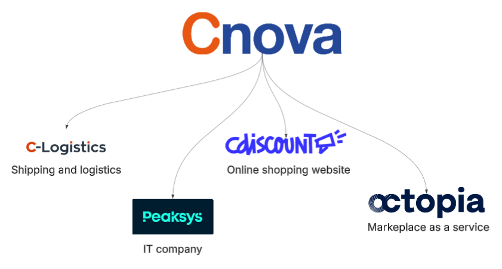

# Tech Lead MLops at Peaksys

## Context

MLops is about managing and automating the ML model lifecycle:
- training
- model artifact storage, traceability, and versioning
- deployment and inference
- monitoring and alerting (e.g. drift detection)
- retraining

By ML model, we mean:
- "classical" machine learning models (e.g. Scikit-Learn-based models, XGBoost, etc.)
- Deep learning models (e.g. PyTorch, TensorFlow, etc.)
- LLM and embedding models (e.g. lib transformers, Hugging Face open-weight models, etc.)

## About the team and my responsibilities

The AI team (aka "CT-IA") was a platform team. Our mission was to build a scalable AI/ML platform that helps all other company's teams to build their own AI/ML products.
Our "clients" were:
- the **Data Scientists** teams, providing them with tools to train, deploy, and manage their models
- the **Machine Learning Engineers**: python developers who work with Data Scientists to industrialize their python code.
- the **IT teams**, providing them with production-ready LLM endpoints (both on-premise and in the cloud)

This team was composed of:
- A manager
- A Platform Owner (PO); Which is the equivalent of a Product Owner
- 3 MLops Engineers
- A Platform Tech Lead

As Platform tech lead, I was responsible for:
- Making technical decisions about the architecture of our platform
- Contributing to the development and the run of our platform
- Ensuring the quality of our assets
- Conducting R&D projects and technical monitoring
- In collaboration with the PO, building the roadmap of the platform
- Mentoring the other team members as well as the Machine Learning Engineers (MLE)
- Contributing to the MLE hiring process and their onboarding

## Key achievements

**✨ On-premise LLMS**

- Deployed on premise models on Kubernetes with constrained resources (few GPUs).
  The models were deployed with Text Generation Inference (for LLM) or Triton Inference Server (for other models, like CLIP).
  Deployment was managed with a custom Helm chart.
  To give access to all our models with a unique endpoint and a simple routing system, I deployed a Traefik proxy in front of them.
  This proxy acted as an AI Gateway.

**🧩 MLflow**
- Deployed an MLflow server on our Kubernetes cluster. 
  Then, developed an OIDC authentication plugin to secure the MLflow instance with our internal Keycloak.

**⛓ CICD pipelines**
- Built a CI/CD pipelines for ML models training and fast experimentation.

**☁️ Azure AI Foundry**
- Managed Azure OpenAI (now known as Azure AI Foundry) models. 
  Those deployments were used by the whole company for miscellaneous AI projects (both internal and external).
  At the beginning, manually, then with an APIOps pipeline.

**💬 Chatbot**
- Developed a RAG chatbot with Langchain

**🔬 R&D**
- Conducted R&D over MCP and multi-agnt architecture in python (a2a-sdk).

**📢 Mentoring and sharing**
- Animated coding dojos about Langchain and Langraph

**🪄 AI workflow development**
- Developing an AI workflow to improve the quality of our product titles and descriptions.

## Other responsibilities

- Helping with Machine Learning Engineer recruitment (conduction interviews) and onboarding.
- Reporting and presentations to the management. Breaking down technical concepts and explaining them to non-technical people.

## About Peaksys

Peaksys is the IT subsidiary of the Cnova Group. This group also owns Cdisocunt, a famous e-commerce platform in France, as well as tow other specialized companies:

- C-Logistics, that ensures shipments and logistics solutions
- Octopia, that provides a Marketplace-as-a-service solution

The Peaksys's customers are the other subsidiaries of Cnova Group.

