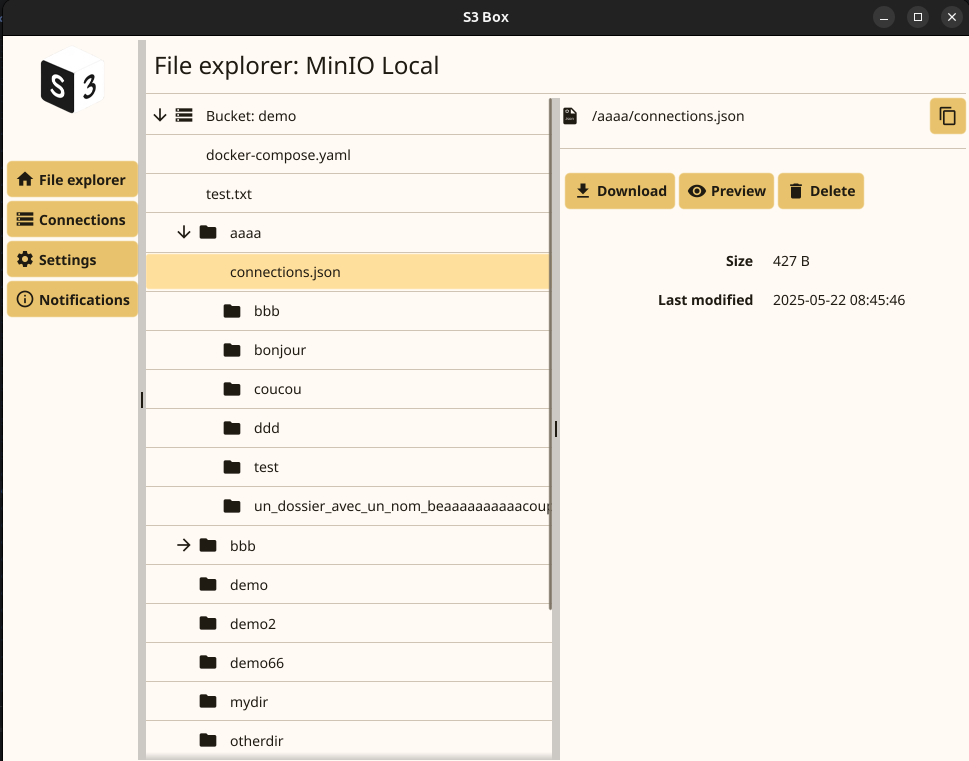
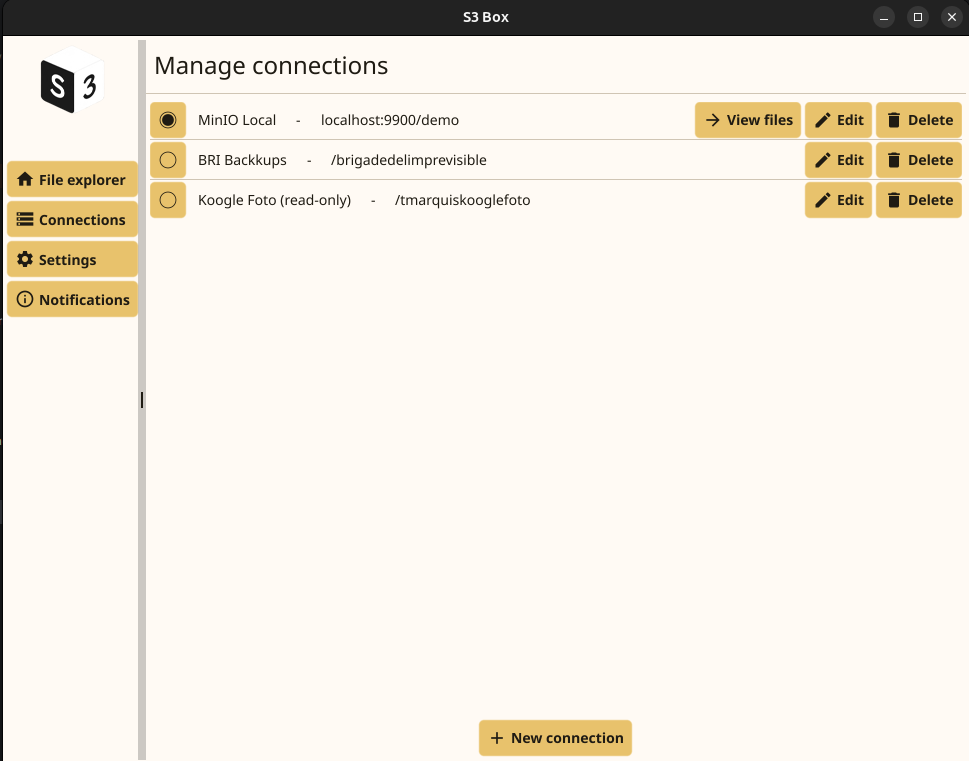
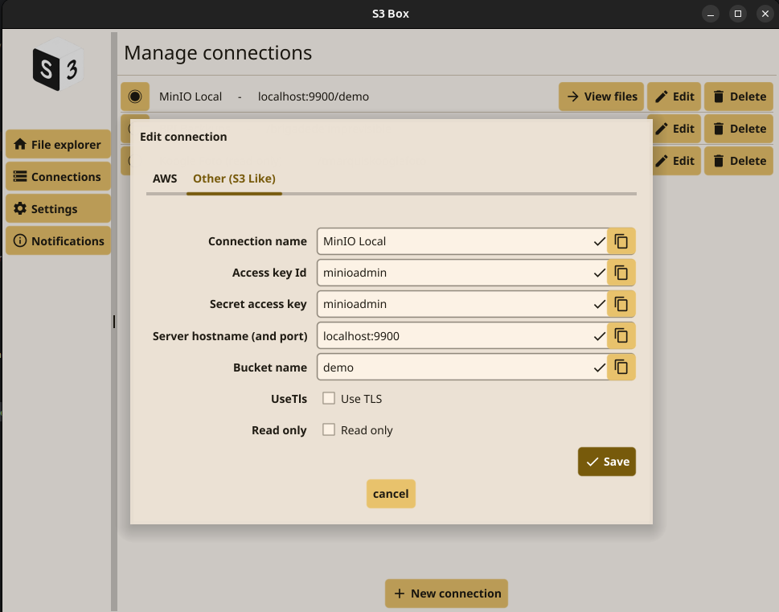

# S3-Box

  

S3-Box is a desktop application for managing S3 buckets, written in Go.

## Presentation

I have always been disappointed by existing S3 client applications—some are overly complex or not user-friendly, while
others are web-based and require complicated setups. Many are also not free.

For these reasons, I decided to create my own S3 client application. Since this project was initially motivated by my
personal needs, I developed it as a side project to address my requirements.

## Links

- [GitHub Repository](https://github.com/thomas-marquis/s3-box)

## Technical Considerations

- **Fyne**: A cross-platform GUI framework ([Fyne](https://fyne.io/)) that enables the development of desktop (and
  mobile) applications in Go.
- **MVVM**: I implemented the Model-View-ViewModel architecture pattern to separate business logic from the UI. View
  models manage business logic and update the application state, allowing the UI to observe changes and update
  accordingly.
- **Event-Driven Architecture**: The application is event-driven. When a domain object's method is called, it emits an
  event, which is then broadcast through an event bus to all relevant parts of the application.
- **Clean Architecture**: The application adheres to clean architecture principles. The domain layer remains independent
  of other layers, with ViewModels acting as the use case layer to orchestrate domain objects.
- **Domain-Driven Design**: I aimed to follow Domain-Driven Design principles, ensuring the domain code closely reflects
  real-world concepts such as files and directories.

## Screenshots

